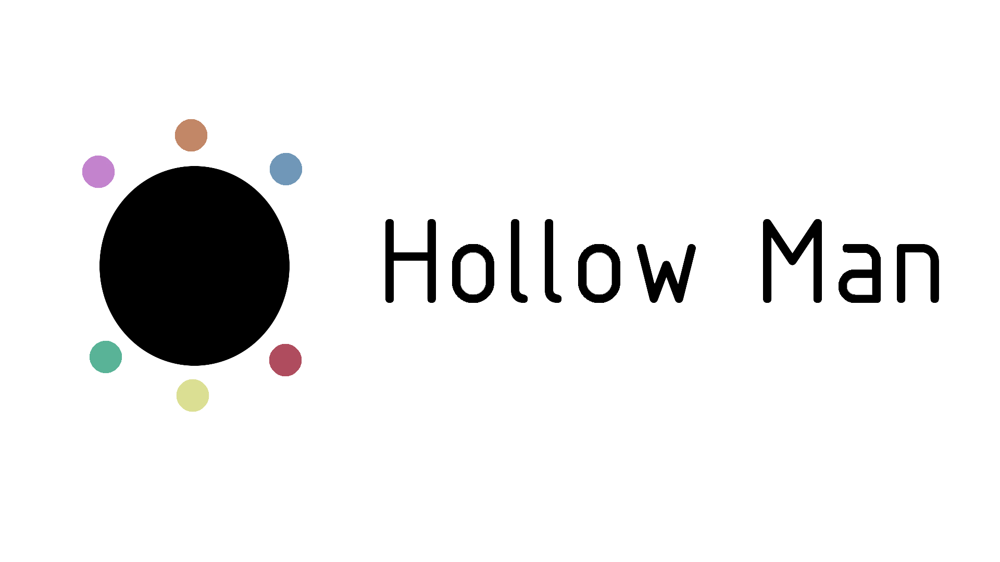

# 我的主页

[点击此链接访问](https://hollowman6.github.io)

此仓库还包含了[FreDuino Cars](https://hollowman6.github.io/FreDuino) 、[Story of LZU](https://hollowman6.github.io/LZU)、[FNST Demo](https://hollowman6.github.io/StyleTrans)这几个Html页面的源代码。

* FreDuino Cars [(源代码)](FreDuino/) 是兰州大学“基于机器人的实践方法”制作机器车的Demo。

相关仓库：[Making a Robot Car](https://github.com/HollowMan6/Answers-for-LZU-CS-UG-Courses/tree/master/Making%20a%20Robot%20Car)

* Story of LZU [(源代码)](LZU/)是由我制作的兰州大学网络文化作品大赛参赛作品。

* FNST Demo [(源代码)](StyleTrans/)是我参与的校级大学生创新创业训练计划项目：“文艺复兴”—— AI+敦煌文化 的衍生作品，同时也是我参与的2019 Google InnoCamp 人工智能[DeepFlying](https://github.com/dslab-deepflying/deepflying/tree/master/InnoCamp)夏令营（张掖）的一个分支项目成果；[有关DeepFlying的报道](http://news.lzu.edu.cn/c/201909/59389.html)。

# Hollow Man Home Page

[Click here to visit](https://hollowman6.github.io)

The Repository also includes the Html Pages Source Code of [FreDuino Cars](https://hollowman6.github.io/FreDuino) 、[Story of LZU](https://hollowman6.github.io/LZU)、[FNST Demo](https://hollowman6.github.io/StyleTrans)

* FreDuino Cars [(Source Code)](FreDuino/) is the Demo for making a robot car in the course "making a robot car".

Relevant Repository: [Making a Robot Car](https://github.com/HollowMan6/Answers-for-LZU-CS-UG-Courses/tree/master/Making%20a%20Robot%20Car)

* Story of LZU [(Source Code)](LZU/)is my work in the Lanzhou University Online Cultural Competition.

* FNST Demo [(Source Code)](StyleTrans/) is the my Derivative work of the University Student Innovation and Entrepreneurship Training Project: "Renaissance" - AI + Dunhuang Culture which I join in. Also it's my achivement of a sub project of 2019 Google InnoCamp AI [DeepFlying](https://github.com/dslab-deepflying/deepflying/tree/master/InnoCamp) that I join in; [Reports concerning DeepFlying](http://news.lzu.edu.cn/c/201909/59389.html)
  